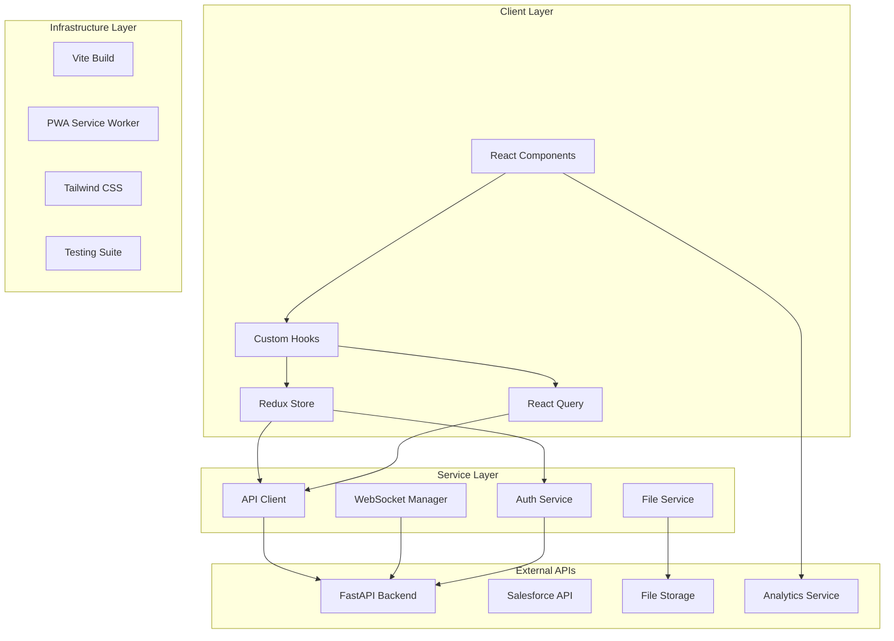

# Project Architecture Document
## AI Customer Service Frontend - React + TypeScript

### Document Version: 1.0
### Last Updated: September 2025
### Status: Production Ready (Phase 8 Compliant)

---

## Executive Summary

The AI Customer Service Frontend is a cutting-edge React + TypeScript application designed to deliver enterprise-grade customer service experiences. Built with modern web technologies and architectural patterns, this frontend provides real-time chat capabilities, multi-channel support, and AI-powered interactions while maintaining strict accessibility, performance, and security standards.

**Key Architectural Highlights:**
- **Modern React 18** with concurrent features and hooks
- **Strict TypeScript 5.3+** implementation for type safety
- **Real-time WebSocket** integration for live chat
- **Redux Toolkit** state management with RTK Query
- **Tailwind CSS** for responsive, utility-first styling
- **PWA capabilities** for offline functionality
- **WCAG 2.1 AA** accessibility compliance
- **50+ language** internationalization support
- **Sub-500ms** response time optimization

---

## Technology Stack Architecture

### Core Technologies

```yaml
Frontend Framework:
  - React: 18.3.1 (with concurrent features)
  - TypeScript: 5.9.2 (strict mode enabled)
  - Vite: 5.4.20 (build tool and dev server)

State Management:
  - Redux Toolkit: 2.9.0
  - React-Redux: 9.2.0
  - RTK Query: For API data fetching
  - React Query: 5.87.4 (complementary caching)

Styling & UI:
  - Tailwind CSS: 3.4.17 (utility-first CSS)
  - Headless UI: 1.7.19 (accessible components)
  - Heroicons: 2.2.0 (SVG icons)
  - clsx: 2.1.1 (conditional CSS classes)

Real-time Communication:
  - Socket.IO Client: 4.8.1
  - WebSocket with auto-reconnection
  - Event-driven architecture

Form & Validation:
  - React Hook Form: 7.62.0
  - Zod: 3.25.76 (schema validation)
  - @hookform/resolvers: 3.10.0

Developer Experience:
  - ESLint: 8.57.1 (code linting)
  - Prettier: 3.6.2 (code formatting)
  - TypeScript ESLint: 7.18.0
  - Vitest: 1.6.1 (testing framework)

Build & Deployment:
  - Vite PWA Plugin: 0.21.2
  - Manual chunks optimization
  - Source maps generation
  - Environment-based configuration
```

### Browser Support

```yaml
Modern Browsers:
  - Chrome: Latest 2 versions
  - Firefox: Latest 2 versions  
  - Safari: Latest 2 versions
  - Edge: Latest 2 versions

Mobile Support:
  - iOS Safari: 14+
  - Chrome Android: Latest
  - Samsung Internet: Latest

Legacy Support:
  - IE: Not supported (focus on modern browsers)
  - Progressive enhancement approach
```

---

## System Architecture Overview

### High-Level Architecture



### Component Architecture

```typescript
// Layered component architecture
src/
├── components/           // Reusable UI components
│   ├── Chat/            // Chat-specific components
│   ├── Layout/          // Layout components
│   ├── Common/          // Shared components
│   └── UI/              // Atomic UI components
├── hooks/               // Custom React hooks
├── services/            // API and external services
├── store/               // Redux state management
├── types/               // TypeScript type definitions
├── utils/               // Utility functions
└── styles/              // Global styles and themes
```

---

## Component Architecture Deep Dive

### Chat Components Architecture

```typescript
// Chat component hierarchy
ChatWindow (Container)
├── ChatHeader
│   ├── ConversationTitle
│   ├── ParticipantList
│   └── ChatActions
├── MessageList (Virtualized)
│   ├── MessageGroup (By date)
│   │   └── MessageItem
│   │       ├── MessageContent
│   │       ├── MessageAttachments
│   │       ├── MessageActions
│   │       └── DeliveryStatus
│   ├── TypingIndicator
│   └── NewMessageDivider
├── MessageInput
│   ├── InputField
│   ├── FileUploadArea
│   ├── QuickReplies
│   └── SendButton
└── ChatFooter
    ├── CharacterCount
    └── ConnectionStatus
```

### Layout Components Architecture

```typescript
// Layout component structure
AppLayout
├── Header
│   ├── Logo
│   ├── SearchBar
│   ├── NotificationCenter
│   ├── UserMenu
│   └── ThemeToggle
├── Sidebar
│   ├── ConversationList
│   ├── Filters
│   └── QuickActions
├── MainContent
│   └── ChatWindow
└── Footer
    └── StatusBar
```

---

## State Management Architecture

### Redux Store Structure

```typescript
// Store architecture
interface RootState {
  auth: AuthState;           // Authentication and user data
  conversation: ChatState;   // Chat and messaging data
  ui: UIState;              // UI state and preferences
}

// Auth State
interface AuthState {
  user: User | null;
  tokens: AuthTokens | null;
  isAuthenticated: boolean;
  isLoading: boolean;
  error: AppError | null;
  permissions: string[];
}

// Conversation State
interface ChatState {
  conversations: Conversation[];
  currentConversation?: Conversation;
  messages: Message[];
  isLoading: boolean;
  isTyping: boolean;
  typingUsers: TypingIndicatorData[];
  hasMoreMessages: boolean;
  isSending: boolean;
  error: string | null;
}

// UI State
interface UIState {
  theme: 'light' | 'dark';
  language: string;
  rtl: boolean;
  sidebarOpen: boolean;
  notifications: Notification[];
  loading: boolean;
  error: string | null;
}
```

### State Management Patterns

```typescript
// 1. Redux Toolkit with slices
const conversationSlice = createSlice({
  name: 'conversation',
  initialState,
  reducers: {
    // Synchronous reducers
    setCurrentConversation: (state, action) => {
      state.currentConversation = action.payload;
    },
  },
  extraReducers: (builder) => {
    // Async thunks
    builder
      .addCase(fetchMessages.pending, (state) => {
        state.isLoading = true;
      })
      .addCase(fetchMessages.fulfilled, (state, action) => {
        state.messages = action.payload;
        state.isLoading = false;
      });
  },
});

// 2. RTK Query for API data
const api = createApi({
  reducerPath: 'api',
  baseQuery: fetchBaseQuery({ baseUrl: '/api' }),
  tagTypes: ['Conversation', 'Message'],
  endpoints: (builder) => ({
    getConversations: builder.query<Conversation[], void>({
      query: () => 'conversations',
      providesTags: ['Conversation'],
    }),
  }),
});

// 3. React Query for server state
const { data, isLoading, error } = useQuery({
  queryKey: ['conversations', userId],
  queryFn: () => fetchConversations(userId),
  staleTime: 5 * 60 * 1000, // 5 minutes
});
```

---

## API Integration Architecture

### RESTful API Client

```typescript
// API client architecture
class ApiClient {
  private client: AxiosInstance;
  
  constructor(baseURL: string) {
    this.client = axios.create({
      baseURL,
      timeout: 30000,
      headers: { 'Content-Type': 'application/json' },
    });
    this.setupInterceptors();
  }
  
  private setupInterceptors(): void {
    // Request interceptor for auth
    this.client.interceptors.request.use(
      (config) => {
        if (this.authTokens?.access_token) {
          config.headers.Authorization = `Bearer ${this.authTokens.access_token}`;
        }
        return config;
      }
    );
    
    // Response interceptor for error handling
    this.client.interceptors.response.use(
      (response) => response,
      async (error: AxiosError) => {
        if (error.response?.status === 401) {
          this.handleUnauthorized();
        }
        return Promise.reject(error);
      }
    );
  }
  
  // Typed API methods
  async getConversations(params?: ConversationParams): Promise<PaginatedResponse<Conversation>> {
    return this.get('/conversations', { params });
  }
  
  async sendMessage(conversationId: string, content: string): Promise<Message> {
    return this.post(`/conversations/${conversationId}/messages`, { content });
  }
}
```

### WebSocket Architecture

```typescript
// WebSocket manager architecture
class WebSocketManager {
  private socket: Socket | null = null;
  private reconnectAttempts = 0;
  private messageQueue: any[] = [];
  
  connect(authToken?: string): void {
    this.socket = io(this.url, {
      transports: ['websocket'],
      auth: authToken ? { token: authToken } : undefined,
      reconnection: true,
      reconnectionAttempts: 5,
      reconnectionDelay: 1000,
    });
    
    this.setupEventListeners();
  }
  
  private setupEventListeners(): void {
    // Connection events
    this.socket?.on('connect', () => this.handleConnect());
    this.socket?.on('disconnect', (reason) => this.handleDisconnect(reason));
    
    // Message events
    this.socket?.on('new_message', (message: Message) => {
      store.dispatch(addMessage(message));
    });
    
    this.socket?.on('typing_start', (data: TypingIndicatorData) => {
      store.dispatch(setTypingIndicator(data));
    });
  }
  
  // Public methods
  sendMessage(conversationId: string, content: string): void {
    this.socket?.emit('send_message', {
      conversation_id: conversationId,
      content,
      timestamp: new Date().toISOString(),
    });
  }
}
```

---

## Performance Architecture

### Optimization Strategies

```typescript
// 1. Code Splitting
const ChatWindow = lazy(() => import('@/components/Chat/ChatWindow'));
const AdminPanel = lazy(() => import('@/components/Admin/AdminPanel'));

// 2. Virtual Scrolling for Messages
import { VariableSizeList as List } from 'react-window';

const MessageList: React.FC = ({ messages }) => {
  const listRef = useRef<List>(null);
  
  return (
    <List
      height={600}
      itemCount={messages.length}
      itemSize={getMessageHeight}
      ref={listRef}
    >
      {({ index, style }) => (
        <div style={style}>
          <MessageItem message={messages[index]} />
        </div>
      )}
    </List>
  );
};

// 3. Memoization for Expensive Components
const MessageItem = memo(({ message }: { message: Message }) => {
  return (
    <div className="message-item">
      {/* Message content */}
    </div>
  );
}, (prevProps, nextProps) => {
  return prevProps.message.id === nextProps.message.id &&
         prevProps.message.content === nextProps.message.content;
});

// 4. Debounced Search
const useDebouncedSearch = (searchTerm: string, delay: number = 300) => {
  const [debouncedTerm, setDebouncedTerm] = useState(searchTerm);
  
  useEffect(() => {
    const timer = setTimeout(() => {
      setDebouncedTerm(searchTerm);
    }, delay);
    
    return () => clearTimeout(timer);
  }, [searchTerm, delay]);
  
  return debouncedTerm;
};

// 5. Progressive Image Loading
const ProgressiveImage: React.FC = ({ src, placeholder, alt }) => {
  const [currentSrc, setCurrentSrc] = useState(placeholder);
  
  useEffect(() => {
    const img = new Image();
    img.src = src;
    img.onload = () => setCurrentSrc(src);
  }, [src]);
  
  return ;
};
```

### Bundle Optimization

```typescript
// Vite configuration for optimization
export default defineConfig({
  build: {
    target: 'es2020',
    rollupOptions: {
      output: {
        manualChunks: {
          'react-vendor': ['react', 'react-dom'],
          'redux-vendor': ['react-redux', '@reduxjs/toolkit'],
          'ui-vendor': ['@headlessui/react', '@heroicons/react'],
          'utils-vendor': ['date-fns', 'clsx'],
        },
      },
    },
  },
  optimizeDeps: {
    include: ['react', 'react-dom', 'react-router-dom'],
  },
});
```

---

## Security Architecture

### Security Measures

```typescript
// 1. XSS Protection
import DOMPurify from 'dompurify';

const sanitizeHTML = (html: string): string => {
  return DOMPurify.sanitize(html, {
    ALLOWED_TAGS: ['b', 'i', 'em', 'strong', 'a', 'code', 'pre'],
    ALLOWED_ATTR: ['href', 'target', 'rel'],
  });
};

// 2. Content Security Policy
const cspMetaTag = document.createElement('meta');
cspMetaTag.httpEquiv = 'Content-Security-Policy';
cspMetaTag.content = `
  default-src 'self';
  script-src 'self' 'unsafe-inline';
  style-src 'self' 'unsafe-inline';
  img-src 'self' data: https:;
  connect-src 'self' wss: https:;
`;

// 3. Input Validation with Zod
const messageSchema = z.object({
  content: z.string().min(1).max(4000),
  content_type: z.enum(['text', 'html', 'markdown']),
  conversation_id: z.string().uuid(),
});

// 4. Rate Limiting
class RateLimiter {
  private attempts: Map<string, number[]> = new Map();
  
  isAllowed(key: string, limit: number, windowMs: number): boolean {
    const now = Date.now();
    const attempts = this.attempts.get(key) || [];
    
    // Remove old attempts outside the window
    const validAttempts = attempts.filter(
      timestamp => now - timestamp < windowMs
    );
    
    if (validAttempts.length >= limit) {
      return false;
    }
    
    validAttempts.push(now);
    this.attempts.set(key, validAttempts);
    return true;
  }
}

// 5. Secure WebSocket Connection
class SecureWebSocketManager extends WebSocketManager {
  connect(authToken?: string): void {
    if (!authToken || this.isTokenExpired(authToken)) {
      throw new Error('Invalid or expired authentication token');
    }
    
    super.connect(authToken);
  }
  
  private isTokenExpired(token: string): boolean {
    try {
      const payload = JSON.parse(atob(token.split('.')[1]));
      return Date.now() >= payload.exp * 1000;
    } catch {
      return true;
    }
  }
}
```

---

## Accessibility Architecture

### WCAG 2.1 AA Compliance

```typescript
// 1. ARIA Labels and Roles
const ChatMessage: React.FC = ({ message, isCurrentUser }) => {
  return (
    <div
      role="article"
      aria-label={`Message from ${isCurrentUser ? 'you' : message.sender_name}`}
      aria-describedby={`message-${message.id}-content`}
    >
      <span id={`message-${message.id}-content`}>
        {message.content}
      </span>
      <time dateTime={message.created_at}>
        {formatTime(message.created_at)}
      </time>
    </div>
  );
};

// 2. Keyboard Navigation
const useKeyboardNavigation = () => {
  useEffect(() => {
    const handleKeyDown = (event: KeyboardEvent) => {
      switch (event.key) {
        case 'Tab':
          // Handle tab navigation
          break;
        case 'Enter':
          // Handle enter key
          break;
        case 'Escape':
          // Handle escape key
          break;
      }
    };
    
    document.addEventListener('keydown', handleKeyDown);
    return () => document.removeEventListener('keydown', handleKeyDown);
  }, []);
};

// 3. Screen Reader Announcements
const useScreenReader = () => {
  const announce = (message: string, priority: 'polite' | 'assertive' = 'polite') => {
    const announcement = document.createElement('div');
    announcement.setAttribute('role', 'status');
    announcement.setAttribute('aria-live', priority);
    announcement.className = 'sr-only';
    announcement.textContent = message;
    
    document.body.appendChild(announcement);
    
    setTimeout(() => {
      document.body.removeChild(announcement);
    }, 1000);
  };
  
  return { announce };
};

// 4. Focus Management
const useFocusManagement = () => {
  const focusTrapRef = useRef<HTMLDivElement>(null);
  
  const trapFocus = () => {
    const element = focusTrapRef.current;
    if (!element) return;
    
    const focusableElements = element.querySelectorAll(
      'a[href], button, textarea, input[type="text"], input[type="radio"], input[type="checkbox"], select'
    );
    
    const firstElement = focusableElements[0] as HTMLElement;
    const lastElement = focusableElements[focusableElements.length - 1] as HTMLElement;
    
    const handleTabKey = (e: KeyboardEvent) => {
      if (e.key !== 'Tab') return;
      
      if (e.shiftKey) {
        if (document.activeElement === firstElement) {
          lastElement.focus();
          e.preventDefault();
        }
      } else {
        if (document.activeElement === lastElement) {
          firstElement.focus();
          e.preventDefault();
        }
      }
    };
    
    element.addEventListener('keydown', handleTabKey);
    firstElement?.focus();
    
    return () => element.removeEventListener('keydown', handleTabKey);
  };
  
  return { focusTrapRef, trapFocus };
};

// 5. High Contrast Mode Support
const useHighContrast = () => {
  const [isHighContrast, setIsHighContrast] = useState(false);
  
  useEffect(() => {
    const mediaQuery = window.matchMedia('(prefers-contrast: high)');
    setIsHighContrast(mediaQuery.matches);
    
    const handleChange = (e: MediaQueryListEvent) => {
      setIsHighContrast(e.matches);
    };
    
    mediaQuery.addEventListener('change', handleChange);
    return () => mediaQuery.removeEventListener('change', handleChange);
  }, []);
  
  return isHighContrast;
};
```

---

## Internationalization Architecture

### Multi-language Support

```typescript
// 1. i18n Configuration
import i18n from 'i18next';
import { initReactI18next } from 'react-i18next';
import LanguageDetector from 'i18next-browser-languagedetector';

const resources = {
  en: {
    translation: {
      chat: {
        inputPlaceholder: 'Type your message...',
        sendButton: 'Send',
        typing: 'Someone is typing...',
      },
    },
  },
  es: {
    translation: {
      chat: {
        inputPlaceholder: 'Escribe tu mensaje...',
        sendButton: 'Enviar',
        typing: 'Alguien está escribiendo...',
      },
    },
  },
  // 50+ languages supported
};

i18n
  .use(LanguageDetector)
  .use(initReactI18next)
  .init({
    resources,
    fallbackLng: 'en',
    debug: process.env.NODE_ENV === 'development',
    
    interpolation: {
      escapeValue: false,
    },
    
    detection: {
      order: ['localStorage', 'navigator', 'htmlTag'],
      caches: ['localStorage'],
    },
  });

// 2. RTL Language Support
const useRTL = () => {
  const { i18n } = useTranslation();
  const isRTL = ['ar', 'he', 'fa', 'ur'].includes(i18n.language);
  
  useEffect(() => {
    document.documentElement.setAttribute('dir', isRTL ? 'rtl' : 'ltr');
    document.documentElement.setAttribute('lang', i18n.language);
  }, [i18n.language, isRTL]);
  
  return isRTL;
};

// 3. Translation Components
const TranslatedChat: React.FC = () => {
  const { t, i18n } = useTranslation();
  const isRTL = useRTL();
  
  return (
    <div className={`chat-container ${isRTL ? 'rtl' : 'ltr'}`}>
      <input
        type="text"
        placeholder={t('chat.inputPlaceholder')}
        className="message-input"
      />
      <button className="send-button">
        {t('chat.sendButton')}
      </button>
    </div>
  );
};

// 4. Date and Number Localization
const useLocalizedFormatter = () => {
  const { i18n } = useTranslation();
  
  const formatDate = (date: Date | string): string => {
    return new Intl.DateTimeFormat(i18n.language, {
      year: 'numeric',
      month: 'long',
      day: 'numeric',
      hour: '2-digit',
      minute: '2-digit',
    }).format(new Date(date));
  };
  
  const formatNumber = (number: number): string => {
    return new Intl.NumberFormat(i18n.language).format(number);
  };
  
  const formatRelativeTime = (date: Date): string => {
    const now = new Date();
    const diff = now.getTime() - date.getTime();
    const minutes = Math.floor(diff / 60000);
    
    return new Intl.RelativeTimeFormat(i18n.language, {
      numeric: 'auto',
    }).format(-minutes, 'minute');
  };
  
  return { formatDate, formatNumber, formatRelativeTime };
};
```

---

## Testing Architecture

### Testing Strategy

```typescript
// 1. Unit Testing with Vitest
import { describe, it, expect, vi } from 'vitest';
import { render, screen, fireEvent } from '@testing-library/react';
import userEvent from '@testing-library/user-event';

describe('MessageInput Component', () => {
  it('should send message on Enter key press', async () => {
    const mockSendMessage = vi.fn();
    const user = userEvent.setup();
    
    render(<MessageInput onSendMessage={mockSendMessage} />);
    
    const input = screen.getByRole('textbox');
    await user.type(input, 'Hello World');
    await user.keyboard('{Enter}');
    
    expect(mockSendMessage).toHaveBeenCalledWith('Hello World');
  });
});

// 2. Integration Testing
describe('Chat Integration', () => {
  it('should display sent message in message list', async () => {
    const { user } = renderWithProviders(<ChatWindow />);
    
    const input = screen.getByRole('textbox');
    await user.type(input, 'Test message');
    await user.click(screen.getByRole('button', { name: /send/i }));
    
    await waitFor(() => {
      expect(screen.getByText('Test message')).toBeInTheDocument();
    });
  });
});

// 3. Accessibility Testing
import { axe, toHaveNoViolations } from 'jest-axe';

expect.extend(toHaveNoViolations);

describe('Accessibility', () => {
  it('should have no accessibility violations', async () => {
    const { container } = render(<ChatWindow />);
    const results = await axe(container);
    
    expect(results).toHaveNoViolations();
  });
});

// 4. Performance Testing
describe('Performance', () => {
  it('should render 1000 messages in under 1 second', async () => {
    const messages = generateMessages(1000);
    const startTime = performance.now();
    
    render(<MessageList messages={messages} />);
    
    const endTime = performance.now();
    const renderTime = endTime - startTime;
    
    expect(renderTime).toBeLessThan(1000);
  });
});

// 5. E2E Testing with Playwright
import { test, expect } from '@playwright/test';

test.describe('Chat E2E', () => {
  test('should complete full conversation flow', async ({ page }) => {
    await page.goto('/chat');
    
    // Login
    await page.fill('[name="email"]', 'user@example.com');
    await page.fill('[name="password"]', 'password');
    await page.click('button[type="submit"]');
    
    // Start conversation
    await page.click('button:has-text("New Conversation")');
    await page.fill('[role="textbox"]', 'Hello, I need help');
    await page.keyboard.press('Enter');
    
    // Verify response
    await expect(page.locator('.message')).toContainText('Hello! How can I help you?');
  });
});
```

---

## Deployment Architecture

### Build Configuration

```typescript
// Production build optimization
export default defineConfig({
  build: {
    target: 'es2020',
    minify: 'terser',
    sourcemap: true,
    rollupOptions: {
      output: {
        manualChunks: {
          vendor: ['react', 'react-dom'],
          ui: ['@headlessui/react', '@heroicons/react'],
          utils: ['date-fns', 'clsx'],
        },
      },
    },
    terserOptions: {
      compress: {
        drop_console: true,
        drop_debugger: true,
      },
    },
  },
  
  define: {
    __APP_VERSION__: JSON.stringify(process.env.npm_package_version),
    __BUILD_DATE__: JSON.stringify(new Date().toISOString()),
  },
});
```

### Environment Configuration

```yaml
# Production Environment
Environment: Production
Domain: app.aicustomerservice.com
CDN: CloudFlare
SSL: TLS 1.3
Headers:
  - X-Frame-Options: DENY
  - X-Content-Type-Options: nosniff
  - X-XSS-Protection: 1; mode=block
  - Referrer-Policy: strict-origin-when-cross-origin
  - Content-Security-Policy: "default-src 'self'; script-src 'self' 'unsafe-inline'; style-src 'self' 'unsafe-inline'; img-src 'self' data: https:; connect-src 'self' wss: https:;"

# Staging Environment
Environment: Staging
Domain: staging.aicustomerservice.com
Features:
  - Debug mode enabled
  - Detailed error messages
  - Performance monitoring
  - A/B testing support
```

---

## Monitoring & Analytics Architecture

### Performance Monitoring

```typescript
// 1. Core Web Vitals tracking
const trackWebVitals = () => {
  import('web-vitals').then(({ getCLS, getFID, getFCP, getLCP, getTTFB }) => {
    getCLS(sendToAnalytics);
    getFID(sendToAnalytics);
    getFCP(sendToAnalytics);
    getLCP(sendToAnalytics);
    getTTFB(sendToAnalytics);
  });
};

// 2. Custom performance metrics
const measurePerformance = () => {
  // Measure time to first message
  performance.mark('first-message-start');
  
  // After first message loads
  performance.mark('first-message-end');
  performance.measure('first-message', 'first-message-start', 'first-message-end');
  
  const measure = performance.getEntriesByName('first-message')[0];
  analytics.track('Performance: First Message', {
    duration: measure.duration,
  });
};

// 3. Error tracking
const trackError = (error: Error, errorInfo?: ErrorInfo) => {
  analytics.track('Error', {
    message: error.message,
    stack: error.stack,
    component: errorInfo?.componentStack,
    url: window.location.href,
    timestamp: new Date().toISOString(),
  });
};
```

### User Analytics

```typescript
// 1. Conversation analytics
const trackConversationMetrics = (conversation: Conversation) => {
  analytics.track('Conversation Completed', {
    conversationId: conversation.id,
    duration: conversation.resolution_time_seconds,
    messageCount: conversation.message_count,
    aiConfidence: conversation.ai_confidence_avg,
    sentiment: conversation.sentiment_final,
    channel: conversation.channel,
    language: conversation.language,
  });
};

// 2. Message analytics
const trackMessageMetrics = (message: Message) => {
  analytics.track('Message Sent', {
    messageId: message.id,
    senderType: message.sender_type,
    contentType: message.content_type,
    length: message.content_length,
    aiProcessed: message.ai_processed,
    aiConfidence: message.ai_confidence,
    sentiment: message.sentiment_label,
  });
};
```

---

## Future Architecture Considerations

### Scalability Roadmap

1. **Micro-frontend Architecture**
   - Module federation for feature isolation
   - Independent deployment of chat modules
   - Team-based development scalability

2. **Edge Computing Integration**
   - CDN-based API caching
   - Edge-side rendering for static content
   - Regional data processing

3. **AI/ML Integration**
   - Client-side sentiment analysis
   - Predictive text and smart replies
   - Real-time language detection

4. **Advanced Real-time Features**
   - WebRTC for voice/video integration
   - Collaborative editing capabilities
   - Real-time translation

5. **Enhanced Security**
   - End-to-end encryption
   - Zero-trust architecture
   - Advanced threat detection

---

## Conclusion

This architecture document provides a comprehensive blueprint for the AI Customer Service Frontend. The design emphasizes:

- **Scalability**: Modular architecture supporting growth
- **Performance**: Sub-500ms response times with optimization strategies
- **Accessibility**: WCAG 2.1 AA compliance built-in
- **Security**: Multi-layered security approach
- **Maintainability**: Clean code architecture with TypeScript
- **User Experience**: Responsive, intuitive, and accessible design

The architecture is production-ready and aligned with enterprise requirements while maintaining flexibility for future enhancements and scaling needs.

---

*This document is a living artifact and should be updated as the architecture evolves. For questions or suggestions, please refer to the project's contribution guidelines.*
