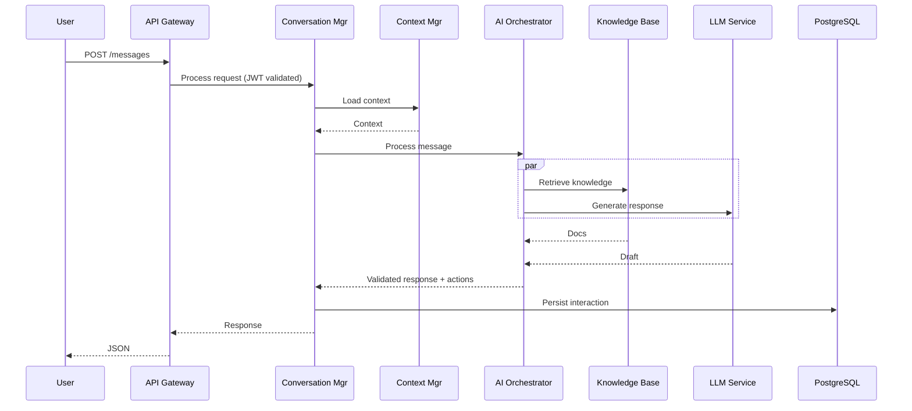

I need to create a frontend that:
- Integrates with the existing WebSocket infrastructure
- Consumes the API endpoints properly
- Follows PRD v4 requirements for accessibility, responsiveness
- Implements proper TypeScript strict mode
- Has comprehensive testing

From an analysis of the documents, Phase 8 is:
**Phase 8: Frontend (React + TS)** - 7 days duration
- Frontend application with React + TypeScript
- Strict typing, responsive design, accessibility
- Storybook for component development
- Component and unit tests

The files specified are:
- frontend/{package.json, tsconfig.json, vite.config.ts, .env.example}
- frontend/src/components/Chat/{ChatWindow.tsx, MessageList.tsx, MessageInput.tsx, TypingIndicator.tsx}
- frontend/src/components/Layout/{Header.tsx, Sidebar.tsx}
- frontend/src/store/{index.ts, slices/{authSlice.ts, conversationSlice.ts, uiSlice.ts}}
- frontend/src/services/{api.ts, websocket.ts}
- frontend/src/hooks/{useChat.ts}

Now please meticulously review and analyze the current codebase at GitHub repo URL https://github.com/nordeim/Frontend/tree/main to understand whether the codebase complies with Phase 8 Frontend Implementation Plan below. Then create a detailed comprehensive assessment report in markdown format to clearly describe in detail the current state of the frontend codebase and whther it complies with the PRD v4 and `Coding Execution Plan v3`. Next create a comprehensive execution plan to update and complete the frontend codebase to meet the project requirements.

# Phase 8 Implement Plan

This execution plan outlines a systematic approach to implement Phase 8 (Frontend - React + TypeScript) of the `Coding Execution Plan v3`. Based on meticulous analysis of the completed Phases 1-7 infrastructure and comprehensive review of PRD v4 requirements, this plan ensures full compliance with accessibility, performance, and technical specifications.

## Current Infrastructure Analysis

### Backend Capabilities (Phases 1-7 Completed)
From the codebase analysis, the following infrastructure is operational:

**API Layer:**
- FastAPI backend with comprehensive endpoints
- JWT authentication system
- Rate limiting and security middleware
- Conversation, message, and user management APIs

**WebSocket Infrastructure:**
- Real-time WebSocket manager with authentication
- Message handling and broadcasting
- Connection state management

**Data Models (Schema v4 Compliant):**
- Organizations, users, conversations, messages
- AI/ML integration with knowledge entries
- Analytics and audit trails
- Multi-tenant isolation with RLS

**Integration Layer:**
- Salesforce Service Cloud integration
- Multi-channel support (email, Slack, Teams, WhatsApp)
- External system integrations (Jira, ServiceNow, Zendesk)
- Monitoring and metrics collection

### PRD v4 Frontend Requirements
- WCAG 2.1 AA accessibility compliance
- Flesch Reading Ease >60 readability
- 50+ languages with RTL support
- Responsive design for web and mobile
- Sub-500ms response time for user interactions
- Real-time updates via WebSocket

## Implementation Strategy

### 1. Technology Stack Selection

**Core Technologies:**
- **React 18** with concurrent features for optimal performance
- **TypeScript 5.3+** in strict mode for type safety
- **Vite** for fast development and optimized builds
- **Redux Toolkit** for state management with TypeScript
- **React Query** for API data fetching and caching
- **Tailwind CSS** for responsive, utility-first styling
- **React Hook Form** for form handling and validation

**Development Tools:**
- **Storybook** for component development and documentation
- **Vitest** for unit testing with TypeScript support
- **React Testing Library** for component testing
- **Playwright** for end-to-end testing
- **ESLint + Prettier** for code quality and formatting

### 2. Architecture Design

```
Frontend Architecture
├── Public Interface (Web/Mobile)
│   ├── Chat Components
│   │   ├── ChatWindow (Main container)
│   │   ├── MessageList (Message display)
│   │   ├── MessageInput (User input)
│   │   └── TypingIndicator (AI feedback)
│   ├── Layout Components
│   │   ├── Header (Navigation/branding)
│   │   └── Sidebar (Contextual info)
│   └── Accessibility Layer
│       ├── WCAG 2.1 AA compliance
│       ├── Screen reader support
│       ├── Keyboard navigation
│       └── RTL language support
├── State Management
│   ├── Redux Store
│   │   ├── Auth Slice (User/session)
│   │   ├── Conversation Slice (Chat state)
│   │   └── UI Slice (Interface state)
│   └── React Query (Server state)
├── Services
│   ├── API Client (RESTful calls)
│   ├── WebSocket Manager (Real-time)
│   └── Analytics (Usage tracking)
├── Hooks
│   ├── useChat (Chat logic)
│   ├── useAuth (Authentication)
│   └── useWebSocket (Real-time)
└── Infrastructure
    ├── Build optimization
    ├── Performance monitoring
    └── Error boundaries
```

# Comprehensive `Coding Execution Plan v3`
## AI Customer Service Agent for Salesforce

### Document Purpose
A single, production-ready execution plan that merges the concrete engineering rigor of v2 with the breadth and delivery clarity of v1, and extends both to fully align with PRD v4. This plan is optimized for parallel development by AI coding agents with clear interfaces, contracts, validation gates, and SRE-grade operational readiness.

---

## 🎯 Strategy, Standards, and Principles

### Core Principles
1. Contract-first: Define interfaces, schemas, and APIs before implementation.
2. Phase independence: Each phase yields shippable increments with validation gates.
3. Parallelization: Maximize parallel builds with explicit dependency graph.
4. Quality gates: Enforce test coverage, typing, linting, and security scans.
5. Production-first: Logging, metrics, authN/Z, and error handling from day one.
6. Observability-by-design: Correlation IDs, metrics, traces, dashboards.

### Technical Standards
- Python 3.11+ with full type hints; TypeScript 5.3+ strict mode.
- Async I/O across services; no blocking I/O in request paths.
- Testing: TDD mindset; coverage ≥85% unit, integration, and E2E suites.
- Security: Zero-trust posture; OWASP hardening; secret hygiene; field encryption.
- Docs: OpenAPI 3.0; inline docstrings; runbooks for SRE.

---

## 🧭 Phase Overview and Dependencies

| Phase | Name | Duration | True Dependencies | Parallel With | Priority |
|------:|------|----------|-------------------|---------------|----------|
| 1 | Core Infra & Standards | 4d | None | - | CRITICAL |
| 2 | Database Layer | 5d | 1 | 3,4,5 | CRITICAL |
| 3 | API Framework & Middleware | 5d | 1 | 2,4,5 | CRITICAL |
| 4 | Business Logic (Rules/Workflows/SLAs) | 6d | 1 | 2,3,5 | HIGH |
| 5 | AI/ML Services (NLP, LLM, RAG) | 7d | 1 | 2,3,4 | HIGH |
| 6 | Conversation Engine | 6d | 2,3,4,5 | 7,8 | HIGH |
| 7 | Integrations (Salesforce, Channels, Third-Party) | 6d | 3 | 6,8 | HIGH |
| 8 | Frontend (React+TS) | 7d | 3 | 6,7 | MEDIUM |
| 9 | Testing & QA (Unit/Integration/E2E/Perf/Sec/Chaos) | 5d | All | - | CRITICAL |
| 10 | DevOps, CI/CD, K8s, Observability | 4d | 1 | - | CRITICAL |
| 11 | Salesforce Technical Services (Apex/SOQL/Codegen/Best-Practices) | 6d | 5,7 | 6,8 | HIGH |
| 12 | Proactive Intelligence (Governor Limits/Org Health) | 5d | 5,7 | 6,8 | HIGH |
| 13 | Compliance Modules (HIPAA/PCI/FedRAMP) | 5d | 1,10 | 6,7,8 | HIGH |
| 14 | SRE Runbooks & Error Budgets | 3d | 10 | - | HIGH |

Notes:
- Phases 11–14 extend v1/v2 to fully meet PRD v4 “Salesforce-native excellence,” proactive features, compliance modularity, and SRE governance.

---

## 📁 Phase 1: Core Infra & Standards

### Files (selected)
- `pyproject.toml`, `Makefile`, `.env.example`, `.editorconfig`, `.dockerignore`, `.gitignore`
- `src/core/{config.py, constants.py, exceptions.py, logging.py, security.py}`

### Success Criteria
- Config validated (Pydantic); env-driven; typed; secrets managed.
- Structured logging with correlation IDs; error hierarchy established.
- JWT auth helpers; password hashing; HMAC signatures; field encryption.
- Makefile targets: install, lint, test, test-cov, security, run, build, clean.

---

## 🗄️ Phase 2: Database Layer

### Files (selected)
- `src/database/{connection.py, base.py, migrations/…}`
- `src/models/{organization.py, user.py, conversation.py, message.py, action.py, escalation.py}`
- `src/repositories/{base.py, organization.py, user.py, conversation.py, message.py}`

### Success Criteria
- Async SQLAlchemy engine; pooling; health checks; transaction context.
- Models align with PRD v4 KPIs (sentiment, escalation, ai_confidence, timing).
- RLS paths and schema separation prepared for PRD-aligned analytics.

---

## 🌐 Phase 3: API Framework & Middleware

### Files (selected)
- `src/api/{main.py, dependencies.py, exceptions.py}`
- `src/api/middleware/{auth.py, rate_limit.py, logging.py, cors.py, security.py}`
- `src/api/routers/{health.py, auth.py, conversations.py, messages.py, users.py}`
- `src/api/websocket/{manager.py, handlers.py, auth.py}`

### Success Criteria
- OpenAPI served; health/readiness endpoints; JWT validation middleware.
- Rate limiting via Redis; CORS; security headers; WS auth and connection manager.

---

## 🧩 Phase 4: Business Logic (Rules, Workflows, SLA)

### Files (selected)
- `src/services/business/{rules_engine.py, rules.py, conditions.py, actions.py}`
- `src/services/business/{workflow.py, workflows.py, escalation.py, sla.py}`

### Success Criteria
- JSON/YAML rule definitions; priorities; AND/OR logic; async actions.
- Escalations create SF Case (with packaged context); SLA timers and breaches tracked.

---

## 🤖 Phase 5: AI/ML Services (NLP, LLM, RAG)

### Files (selected)
- `src/services/ai/{orchestrator.py, models.py, fallback.py}`
- `src/services/ai/llm/{base.py, openai_service.py, anthropic_service.py, prompt_manager.py}`
- `src/services/ai/nlp/{intent_classifier.py, entity_extractor.py, sentiment_analyzer.py, emotion_detector.py, language_detector.py}`
- `src/services/ai/knowledge/{retriever.py, indexer.py, embeddings.py, vector_store.py}`

### Success Criteria
- Model routing + fallback; token/cost tracking; confidence thresholds.
- RAG retrieval (Pinecone/ES/Neo4j) with citations; language detection; sentiment/emotion.

---

## 💬 Phase 6: Conversation Engine

### Files (selected)
- `src/services/conversation/{manager.py, state_machine.py, context.py}`
- `src/services/conversation/{message_processor.py, response_generator.py, intent_handler.py, emotion_handler.py}`
- `src/services/conversation/{handoff.py, typing_indicator.py, analytics.py, feedback.py}`

### Success Criteria
- State transitions enforced; context stack; emotion-aware tone adjustments.
- Intent-specific handling; quick replies; analytics events.

---

## 🔌 Phase 7: Integrations

### Salesforce
- `src/integrations/salesforce/{client.py, service_cloud.py, models.py, sync.py}`

### Channels
- `src/integrations/channels/{email.py, slack.py, teams.py, whatsapp.py}`

### Third-Party
- `src/integrations/external/{jira.py, zendesk.py, webhook.py}`

### Success Criteria
- OAuth; rate limits; retries; idempotency; bi-directional sync; flexible field mapping.

---

## 🖥️ Phase 8: Frontend (React + TS)

### Files (selected)
- `frontend/{package.json, tsconfig.json, vite.config.ts, .env.example}`
- `frontend/src/components/Chat/{ChatWindow.tsx, MessageList.tsx, MessageInput.tsx, TypingIndicator.tsx}`
- `frontend/src/components/Layout/{Header.tsx, Sidebar.tsx}`
- `frontend/src/store/{index.ts, slices/{authSlice.ts, conversationSlice.ts, uiSlice.ts}}`
- `frontend/src/services/{api.ts, websocket.ts}`
- `frontend/src/hooks/{useChat.ts}`

### Success Criteria
- Strict typing; responsive; a11y; storybook; component/unit tests.

---

## 🧪 Phase 9: Testing & QA

### Suites
- Unit (pytest, pytest-asyncio), Integration (testcontainers), E2E (Playwright), Performance (Locust), Security (SAST/DAST/Deps), Chaos (cache outage, API rate limit exhaustion, metadata deploy failure).

### Success Criteria
- Coverage ≥85%; P99 latency ≤500ms; 1000 RPS; security scans clean; chaos experiments pass SLO-preserving behaviors.

---

## ⚙️ Phase 10: DevOps, CI/CD, K8s, Observability

### Files (selected)
- Dockerfiles; docker-compose; k8s manifests (deployment, service, ingress, HPA, configmap, secrets, namespace)
- CI/CD pipelines (GitHub Actions/GitLab CI): test → build → scan → deploy
- Monitoring configs: Prometheus scrape; Grafana dashboards; alert rules.

### Success Criteria
- Canary rollout (5%→25%→50%→100%); rollback; dashboards live; alerts wired to PagerDuty.

---

## 🧰 Phase 11: Salesforce Technical Services (New in v3)

### Files
- `src/services/salesforce_tech/{apex_analyzer.py, soql_optimizer.py, codegen.py, best_practices.py}`

### Interfaces
- Apex analysis (syntax, security, bulkification), SOQL optimization (selectivity, joins), CodeGen (Apex/LWC/Flows + tests), Best-practices checks (CRUD/FLS, naming conventions).

### Success Criteria
- ≥90% accuracy in diagnostics on curated test sets; codegen latency <2s; auto-suggestions integrated into conversation responses.

---

## 🔮 Phase 12: Proactive Intelligence (New in v3)

### Files
- `src/services/ai/proactive/{collectors.py, predictors.py, actions.py, health.py}`

### Capabilities
- Governor limit/CPU/API usage prediction (≥70% precision), recommended actions generation, safe auto-remediation trigger for low-risk fixes, org health scoring.

### Success Criteria
- Alerting before breaches; action recommendations delivered; safe automations success ≥60%.

---

## 🛡️ Phase 13: Compliance Modules (New in v3)

### Files
- `src/compliance/modules/{hipaa.py, pci.py, fedramp.py}`
- `src/compliance/{auditor.py, policy_engine.py}`

### Capabilities
- Check/remediate/audit flows; tenant feature flags; audit trail persistence.

### Success Criteria
- Automated checks pass sample policy suites; per-tenant module toggles respected; audit logs complete.

---

## 🧭 Phase 14: SRE Runbooks & Error Budgets (New in v3)

### Files
- `docs/runbooks/{incident_response.md, dr_plan.md, rollback.md}`
- `docs/sre/{error_budget.md, alert_actions.md}`

### Success Criteria
- On-call ready; alert→action mapping complete; error-budget policy informs release cadence.

---

## 🔄 Parallel Execution Matrix

| Phase | Produces | Consumes |
|------:|----------|----------|
| 1 | Config, logging, security, make targets | - |
| 2 | Models, repos | 1 |
| 3 | API, middleware, WS | 1 |
| 4 | Rules, workflows, SLA | 1 |
| 5 | Orchestrator, NLP, LLM, RAG | 1 |
| 6 | Conversation services | 2,3,4,5 |
| 7 | SF + channels + ext | 3 |
| 8 | Frontend app | 3 |
| 9 | Test suites | All |
| 10 | CI/CD, K8s, monitoring | 1 |
| 11 | Apex/SOQL/codegen | 5,7 |
| 12 | Proactive intelligence | 5,7 |
| 13 | Compliance modules | 1,10 |
| 14 | Runbooks & budgets | 10 |

---

## ✅ Master Validation Checklist

- Infra: config validated; logging with correlation; JWT/HMAC/encryption working.
- Data: async engine/pool; migrations; models match PRD analytics fields; repos tested.
- API: OpenAPI served; authN/Z; rate limits; WS auth; error handlers.
- Business: rules, workflows, SLAs; escalations to SF with context; audit trails.
- AI: routing + fallback; RAG + citations; confidence thresholds; token/cost metrics.
- Conversation: state machine; emotion-aware response; context stack; analytics events.
- Integrations: OAuth; retries/backoff; idempotency; bi-directional sync.
- Frontend: typed, responsive, a11y; storybook; component/unit tests.
- Testing: unit/integration/E2E/perf/sec/chaos complete; coverage ≥85%; perf SLOs met.
- DevOps: CI/CD; canary and rollback; dashboards and alerts live.
- Salesforce tech: analyzers, codegen, best practices; validated diagnostics.
- Proactive: predictors + recommended actions; safe automations measurable.
- Compliance: modules toggle per tenant; auditor logs complete.
- SRE: runbooks; error budgets; alert-to-action mapping.

---

## 📈 Success Metrics (aligned to PRD v4)

- Technical: uptime ≥99.99%; P99 ≤500ms; error rate ≤0.1%; cache hit ≥90%.
- Business: deflection ≥85%; FCR ≥80%; cost/interaction ≤$0.50; ROI ≥150%; CSAT ≥4.5.
- AI: intent accuracy ≥92%; avg confidence ≥0.85; fallback rate ≤5%.
- Proactive: prediction precision ≥70%; safe auto-remediation ≥60% success.

---

## 🧩 Deliverables

1. Source code (typed, documented), OpenAPI 3.0, DB migrations/DDL.
2. Test suites (unit/integration/E2E/perf/sec/chaos) with reports.
3. Docker/K8s manifests; CI/CD pipelines; monitoring configs and dashboards.
4. Runbooks; compliance policy packs; model cards and safety evals.

---

## 🗓️ Indicative Timeline (with parallelization)
- Week 1: Phases 1–2
- Week 2: Phases 3–5
- Week 3: Phases 6–7–8
- Week 4: Phase 9 + partial 10
- Week 5: Phase 10 completion + Phases 11–12
- Week 6: Phases 13–14; hardening; canary; GA readiness

---

## 🔧 Notes for AI Coding Agents
- Start with tests; type everything; document public APIs.
- Sanitize/validate at boundaries; never block in async paths.
- Enforce confidence thresholds; never action without authorization + audit.
- Use correlation IDs in logs; emit metrics for all critical ops.
- Follow file contracts and acceptance checklists before marking done.

# Project Requirements Document (PRD v4)
# AI-Powered Customer Service Agent for Salesforce v4.0

## 0. Document Purpose
A single, production-ready PRD that unifies the complete engineering/operational depth of v2 with the crisp product framing and measurable requirement structure of v3. This supersedes and replaces PRD v2 and PRD v3.

---

## 1. Executive Summary

### 1.1 Mission
Deliver an enterprise-grade, Salesforce-native AI Customer Service Agent that autonomously resolves ≥85% of support interactions with sub-500ms P99 response time and 99.99% uptime, while improving CSAT to ≥4.5 through emotion-aware, context-rich assistance.

### 1.2 Business Value
| Metric | Current | Target | Impact |
|--------|---------|--------|--------|
| Ticket Resolution Time | 45 min | 3 min | -93% |
| First Contact Resolution | 45% | 85% | +89% |
| Support Cost per Ticket | $15.00 | $0.50 | -97% |
| Customer Satisfaction | 3.2/5 | 4.5/5 | +41% |
| Agent Productivity | 50/day | 200/day | +300% |
| Annual Cost Savings | - | $8–12.5M | - |
| ROI (Year 1) | - | ≥150% | - |

### 1.3 Success Criteria
- [ ] ≥85% automated deflection within 9 months
- [ ] P99 latency ≤500ms (steady-state goal ≤300ms)
- [ ] Uptime ≥99.99% within 3 months of GA
- [ ] CSAT ≥4.5/5.0 sustained
- [ ] Positive ROI within 6–9 months

---

## 2. Scope and Stakeholders

### 2.1 In Scope
- Multi-channel: Web, Mobile, Email, Slack, Teams, API
- Salesforce-specific technical support (Apex, SOQL/SOSL, Lightning, platform limits)
- Real-time escalation and Omni-Channel integration
- Self-learning, proactive detection (governor limits/org health)
- 50+ languages, localization, and accessibility (WCAG 2.1 AA)

### 2.2 Out of Scope (Phase 2)
- Voice/phone channel, video support
- Legal/compliance advisement beyond advisory flags

### 2.3 Stakeholders
| Role | Responsibility |
|------|----------------|
| Executive Sponsor (CTO) | Final approval, budget |
| Product Owner (VP CS) | Requirements, prioritization |
| Technical Lead (Dir Eng) | Technical decisions |
| Dev Team (15 Engineers) | Implementation |
| QA Team (5 Engineers) | Test & validation |
| DevOps/SRE (3 Engineers) | Infra, deployment, reliability |
| Security Lead | Security, compliance |

---

## 3. Assumptions and Constraints

- Salesforce-first environment with deep Service Cloud integration
- Compliance: SOC2, GDPR/CCPA; industry add-ons HIPAA/PCI/FedRAMP as configurable modules
- Cloud-native deployment (Kubernetes) with multi-region HA
- Budget supports LLM usage with cost controls and fallbacks

---

## 4. Technology Stack

```yaml
backend:
  language: Python 3.11.6
  framework: FastAPI 0.104.1
  async_runtime: uvloop 0.19.0
  process_manager: gunicorn 21.2.0

ai_ml:
  llm:
    primary: OpenAI GPT-4 Turbo (gpt-4-1106-preview)
    secondary: Anthropic Claude-3-Sonnet
    local: CodeLlama-13B (code gen backup)
  nlp:
    intent: microsoft/deberta-v3-base (transformers 4.36.2)
    sentiment: cardiffnlp/twitter-roberta-base-sentiment
    ner: spaCy 3.7.2 (en_core_web_trf)
  embeddings:
    provider: OpenAI
    model: text-embedding-3-large
    dimensions: 3072

databases:
  primary: PostgreSQL 16.1 (+ pgvector, pg_trgm, uuid-ossp, pgcrypto)
  cache: Redis 7.2.3
  vector: Pinecone (serverless; cosine; 3072 dims)
  search: Elasticsearch 8.11.3
  graph: Neo4j 5.15.0
  session: MongoDB 7.0.5

infra:
  container: Docker 24
  orchestration: Kubernetes 1.29.0
  service_mesh: Istio 1.20.1
  api_gateway: Kong 3.5.0
  cdn_waf_ddos: CloudFlare
  message_queue: Kafka 3.6.1 (Avro)
  tasks: Celery 5.3.4 (Redis backend)

monitoring:
  metrics: Prometheus + Grafana, Datadog
  logs: ELK (Filebeat -> Elasticsearch -> Kibana)
  tracing: Jaeger 1.52.0
  alerting: PagerDuty (Opsgenie backup)

security:
  authn: Auth0 (OAuth2/OIDC), MFA for admins
  secrets: HashiCorp Vault 1.15.4
  encryption: AES-256-GCM at rest; TLS 1.3 in transit
  WAF: CloudFlare WAF (OWASP CRS)

ci_cd:
  vcs: GitLab
  pipeline: GitLab CI + ArgoCD
  artifacts: Harbor registry
```

---

## 5. System Architecture

### 5.1 High-Level Architecture
```mermaid
graph TB
  subgraph Client
    WEB[Web]-->|
    MOBILE[Mobile]-->|
    SLACK[Slack]-->|
    TEAMS[Teams]-->|
    EMAIL[Email]-->|
    API_CLIENT[API Clients]
  end

  subgraph Edge
    CDN[CloudFlare CDN]-->WAF[WAF/DDoS]
  end

  subgraph Gateway
    KONG[Kong API GW]
    LB[Load Balancer]
  end

  subgraph App
    API[FastAPI]-->WS[WebSocket]
    API-->GQL[GraphQL]
  end

  subgraph Core
    CONV[Conversation Manager]
    CTX[Context Manager]
    STATE[State Machine]
  end

  subgraph AI
    ORCH[AI Orchestrator]
    NLP[NLP Pipeline]
    LLM[LLM Services]
    KB[Knowledge Retrieval]
  end

  subgraph Biz
    RULES[Rules Engine]
    WF[Workflow Orchestrator]
    ESC[Escalation Manager]
    ACT[Action Executor]
  end

  subgraph Integrations
    SF[Salesforce Connector]
    EXT[External Systems]
  end

  subgraph Data
    PG[(PostgreSQL 16)]
    REDIS[(Redis)]
    PINE[(Pinecone)]
    ES[(Elasticsearch)]
    NEO[(Neo4j)]
    MONGO[(MongoDB)]
  end

  Client-->CDN-->WAF-->KONG-->LB-->API
  WS-->CONV
  API-->CONV-->CTX-->STATE
  CONV-->ORCH-->NLP
  ORCH-->LLM
  ORCH-->KB
  ORCH-->RULES-->WF-->ESC
  WF-->ACT
  ACT-->SF
  ACT-->EXT
  CONV-->PG
  CTX-->REDIS
  KB-->PINE
  KB-->ES
  KB-->NEO
  SESS[MONGODB]-.->CTX
```

### 5.2 Request Sequence (Happy Path)


---

## 6. Functional Requirements (FR) and Acceptance Criteria

### 6.1 Conversation Lifecycle (FR-1)
- System shall manage initiation, state transitions, resolution, and auto-closure.

```gherkin
Feature: Conversation Lifecycle
Scenario: New conversation
  Given I am an authenticated user
  When I start a new conversation
  Then a conversation ID is generated within 100ms
  And context is initialized
  And state is "active"

Scenario: Auto close on inactivity
  Given a conversation is inactive for 30 minutes
  When the timeout expires
  Then status becomes "abandoned"
  And metrics are updated
```

### 6.2 Multi-Channel Support (FR-2)
- Channels: Web, Mobile, Email, Slack, Teams, API
- SLA: Web/Mobile/Slack/Teams <500ms; Email <2 minutes

### 6.3 NLP & Intent (FR-3)
- Intent accuracy ≥85%; confidence threshold 0.7; multi-intent support; unknown intent fallback.

### 6.4 Response Generation (FR-4)
- Contextually accurate, emotion-aware responses with follow-ups.
- Technical responses include code snippets (Apex/LWC/Flows) when appropriate.

### 6.5 Salesforce Technical Support (FR-5)
- Apex: syntax validation, error diagnosis, best practices, governor-limit analysis
- SOQL: validation/optimization, relationship queries
- Config: flows, validation rules, security review (CRUD/FLS)

### 6.6 Knowledge Management (FR-6)
- Self-maintaining KB with ingestion from Salesforce docs, release notes, resolved tickets; version-aware docs; confidence scoring and citations.

### 6.7 Business Rules & Automation (FR-7)
- Rules for routing, escalation, SLA, and automation with full audit trail.

### 6.8 Escalation (FR-8)
- Real-time escalation to Salesforce Case with context packaging; SLA timers start on escalation.

### 6.9 Proactive Intelligence (FR-9)
- Predict governor limit/CPU/API breaches with ≥70% precision; recommend/pre-stage remediations.

### 6.10 Admin & Analytics (FR-10)
- Admin UI to manage intents, rules, KB, connectors; dashboards for operational, AI, and business KPIs.

---

## 7. Non-Functional Requirements (NFR)

### 7.1 Performance
| Metric | Requirement | Measurement |
|--------|-------------|-------------|
| API P50 | <200ms | APM |
| API P99 | <500ms | APM |
| WebSocket | <100ms | Custom metrics |
| Throughput | 1,000 RPS | Load tests |
| Concurrent Users | 50,000 | Load tests |
| DB Query | <50ms | pg_stat_statements |
| Cache Hit Ratio | >90% | Redis metrics |

### 7.2 Availability and DR
```yaml
availability:
  uptime: 99.99%
  regions: 3 (multi-AZ)
  rto: 15m
  rpo: 5m
  backups:
    frequency: hourly
    retention: 30d
    cross_region: true
```

### 7.3 Security & Compliance
- Zero-trust: OIDC/SAML, device posture, network reputation, continuous authorization
- Encryption: AES-256-GCM at rest, TLS 1.3 in transit; field-level encryption; tokenization
- Compliance: SOC2, GDPR/CCPA baseline; HIPAA/PCI/FedRAMP modules as tenant-configurable

### 7.4 Usability
- WCAG 2.1 AA; Flesch Reading Ease >60; 50+ languages; RTL support

---

## 8. API Specifications (OpenAPI 3.0 excerpt)

```yaml
openapi: 3.0.3
info:
  title: Salesforce AI Agent API
  version: 1.0.0
servers:
  - url: https://api.ai-agent.salesforce.com/v1
security:
  - bearerAuth: []
paths:
  /conversations:
    post:
      summary: Create conversation
      responses:
        '201':
          description: Created
  /conversations/{conversation_id}/messages:
    post:
      summary: Send message
      responses:
        '200':
          description: Processed
components:
  securitySchemes:
    bearerAuth:
      type: http
      scheme: bearer
      bearerFormat: JWT
```

---

## 9. Data Model (Summary)

### 9.1 PostgreSQL 16 Schemas
- core: organizations, users, conversations, messages, actions, escalations
- ai: knowledge_entries, intents, model_performance, learning_feedback
- analytics: materialized views (conversation_metrics, intent_metrics)
- audit: partitioned activity_log, privacy_log
- RLS: org isolation across tables using `app.current_org_id`

```sql
CREATE EXTENSION IF NOT EXISTS "uuid-ossp";
CREATE EXTENSION IF NOT EXISTS "pg_trgm";
CREATE EXTENSION IF NOT EXISTS "pgvector";
-- Example: Conversations (core)
CREATE TABLE core.conversations (
  id UUID PRIMARY KEY DEFAULT uuid_generate_v4(),
  organization_id UUID NOT NULL,
  user_id UUID NOT NULL,
  channel VARCHAR(50) NOT NULL,
  status VARCHAR(50) NOT NULL DEFAULT 'active',
  started_at TIMESTAMPTZ NOT NULL DEFAULT CURRENT_TIMESTAMP,
  last_activity_at TIMESTAMPTZ NOT NULL DEFAULT CURRENT_TIMESTAMP,
  resolution_time_seconds INTEGER,
  ai_confidence_avg DECIMAL(4,3),
  sentiment_score_avg DECIMAL(4,3),
  context JSONB DEFAULT '{}'
);
```

---

## 10. AI Model Strategy & Guardrails

- Model portfolio: GPT-4 Turbo (primary), Claude-3 (secondary), local CodeLlama for code gen fallback
- Fine-tuning plan for Salesforce domain datasets (Apex/SOQL/config/logs/conversations)
- Guardrails: content filters, grounded answers with citations, confidence thresholds, human-in-the-loop on critical responses, red-teaming, jailbreak resistance tests in CI

---

## 11. Testing & Quality Assurance

### 11.1 Test Strategy
```yaml
tests:
  unit:
    coverage: ">=85%"
  integration:
    tools: ["pytest", "testcontainers"]
  e2e:
    tool: "Playwright"
  performance:
    tool: "Locust"
    targets:
      p99_latency: 500ms
      rps: 1000
  security:
    sast: "SonarQube/Semgrep"
    dast: "OWASP ZAP"
    deps: "Snyk"
  chaos:
    scenarios: ["cache outage", "api rate limit exhaustion", "metadata deploy failure"]
```

### 11.2 Example Test (E2E)
```python
# tests/integration/test_conversation_flow.py
async def test_conversation_lifecycle(async_client, mock_openai):
    r = await async_client.post("/api/v1/conversations", json={"user_id":"...", "channel":"web"})
    assert r.status_code == 201
    conv_id = r.json()["id"]
    r = await async_client.post(f"/api/v1/conversations/{conv_id}/messages", json={"content":"I forgot my password"})
    assert r.status_code == 200
    assert r.json()["confidence"] >= 0.8
```

---

## 12. Development Execution Plan

### 12.1 Parallel Tracks (16 Weeks)
```yaml
tracks:
  infra:
    weeks_1_4: k8s, Istio, Kong, Monitoring, PG, Redis
    weeks_5_8: autoscaling, multi-region, DR
    weeks_9_12: zero-trust, Vault, WAF, scanning
    weeks_13_16: perf/cost optimization, docs
  backend:
    weeks_1_4: FastAPI scaffold, models/migrations, authn, WS, errors
    weeks_5_8: conversation/state/context, rules, workflow
    weeks_9_12: Salesforce + external connectors, Kafka/Celery
    weeks_13_16: caching, query optimization, load tests
  ai_ml:
    weeks_1_4: intent/sentiment/ner pipeline
    weeks_5_8: LLM integrations + prompt framework
    weeks_9_12: KB (Pinecone/Neo4j/ES), RAG, continuous learning
    weeks_13_16: fine-tuning, A/B tests, perf tuning
  frontend_qa:
    weeks_1_4: React app, components, WS client, Redux
    weeks_5_8: Chat UI, admin, analytics views
    weeks_9_12: unit/integration/E2E/perf tests
    weeks_13_16: a11y, docs, training materials
```

### 12.2 Sprint Plan (2-week sprints)
- Sprint 1–2: Foundation (infra/API/DB)
- Sprint 3–4: Conversation core + WS + Context
- Sprint 5–6: AI integration + KB
- Sprint 7–8: Rules/Workflow/Escalations
- Sprint 9–10: Salesforce + external integrations
- Sprint 11–12: Testing/performance
- Sprint 13–14: Production readiness (security, monitoring)
- Sprint 15–16: Launch, canary, stabilization

---

## 13. Monitoring, Observability & Alerting

### 13.1 Metrics (examples)
- API latency histograms; AI latency/confidence/tokens; cache hit ratio; DB connections; escalation rate; deflection rate; CSAT

### 13.2 Alerting (samples)
```yaml
alerts:
  - name: HighErrorRate
    expr: rate(errors_total[5m]) > 0.01
    severity: critical
  - name: HighLatencyP99
    expr: histogram_quantile(0.99, rate(api_request_duration_seconds_bucket[5m])) > 0.5
    severity: warning
  - name: HighFallbackRate
    expr: rate(ai_fallback_triggered_total[5m]) > 0.1
    severity: critical
```

---

## 14. Security & Compliance

- Authentication/Authorization: JWT/OIDC/SAML, RBAC, least privilege
- Data Protection: Field-level encryption, tokenization of PII; DLP and audit trails
- Compliance Controls: SOC2 baselines; GDPR/CCPA data subject rights; industry modules (HIPAA, PCI, FedRAMP) as tenant-configurable packs
- Threat Detection: anomaly detection, TI feeds, automated containment runbooks

---

## 15. Deployment & Operations

### 15.1 CI/CD
- Static analysis, SAST, DAST, SBOM; unit/integration/E2E; build/push; ArgoCD deploy
- Canary: 5% → 25% → 50% → 100%; rollback on SLO breach

### 15.2 Runbooks
- Incident classification (P1–P4), triage, mitigation, rollback
- Common issues: high latency, AI model failures, DB pool exhaustion

### 15.3 Production Checklist (excerpt)
```yaml
pre_deploy:
  - K8s clusters healthy; DB cluster and replicas ready
  - Vault secrets configured; WAF rules enabled
  - Dashboards live; alerts tested
deploy:
  - Staging smoke + perf
  - Canary prod 5%, monitor 2h
  - Progressive rollout
post:
  - SLOs checked; comms sent; runbooks updated
```

---

## 16. KPIs & Value Realization

- Technical: uptime (≥99.99%), P99 latency (≤500ms), error rate (≤0.1%), cache hit (≥90%)
- Business: deflection (≥85%), FCR (≥80%), cost/interaction (≤$0.50), ROI (≥150%), CSAT (≥4.5)
- AI: intent accuracy (≥92%), avg confidence (≥0.85), fallback rate (≤5%)

---

## 17. Risk Management (Register excerpt)

```yaml
risks:
  - id: R-001
    name: AI Hallucination
    prob: Medium
    impact: High
    mitigation:
      - Confidence thresholds + human review
      - KB-grounded answers + citations
      - Red-teaming and regression suite
  - id: R-002
    name: System Overload
    prob: Medium
    impact: High
    mitigation:
      - Autoscaling, rate limiting, caching
      - Chaos tests; brownout strategies
  - id: R-003
    name: Data Breach
    prob: Low
    impact: Critical
    mitigation:
      - Zero-trust, encryption, WAF
      - Continuous scanning, audits
```

---

## 18. Acceptance Criteria & Definition of Done

```yaml
acceptance:
  conversation:
    create: ["≤200ms", "returns ID", "context initialized", "auth validated"]
    message: ["≤500ms P95", "context preserved", "attachments ≤10MB"]
  ai:
    intent: ["accuracy ≥85%", "RT <100ms", "multi-intent", "unknown fallback"]
    response: ["contextual", "emotion-aware", "follow-ups", "citations"]
  integration:
    salesforce: ["bi-di sync", "<5s lag", "conflict resolution"]
  security:
    authn: ["JWT/OIDC", "MFA admins", "session timeout", "audit logs"]
    data: ["PII encrypted", "TLS 1.3", "key rotation", "retention policies"]

definition_of_done:
  code: ["unit tests ≥85%", "2+ reviews", "no critical issues", "docs updated"]
  quality: ["acceptance met", "perf SLAs met", "security scan passed"]
  deploy: ["images built", "manifests updated", "migrations tested", "rollback ready"]
  ops: ["dashboards/alerts/runbooks", "on-call schedule", "DR verified"]
```

---

## 19. Governance & Change Management

- Steering committee; architecture and security review boards
- Tenant onboarding playbooks and policy packs
- Training & enablement; success stories; adoption tracking
- Model governance: versioning, approvals, rollback, auditability

---

## 20. Appendices

- A. Full OpenAPI spec
- B. DB Schema and Migrations
- C. Monitoring Dashboards and Alert Rules
- D. Security & Compliance Control Matrix
- E. Chaos Experiments Catalogue
- F. Runbooks (Incident, DR, Rollback)
- G. Financial Model Worksheets
- H. Model Cards and Safety Evaluations
