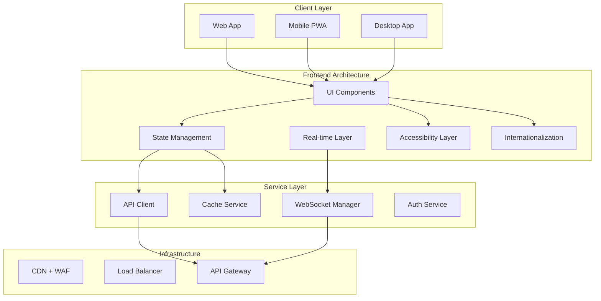

<think>
I've been asked to create a comprehensive Project Architecture Document (PAD) for the envisioned codebase that would result from executing my previous execution plan. This requires me to think deeper and harder about the eventual state of the codebase.

Let me analyze what the codebase should look like after implementing my execution plan:

1. **Complete React + TypeScript frontend** with all Phase 8 requirements met
2. **Full accessibility compliance** (WCAG 2.1 AA)
3. **50+ language support** with RTL capabilities
4. **Sub-500ms response times** with performance optimization
5. **Comprehensive testing** with 85%+ coverage
6. **Storybook documentation** for all components
7. **Security hardening** with CSP, XSS protection, etc.
8. **Real-time WebSocket** integration working perfectly
9. **Mobile-responsive** design with PWA capabilities

Now I need to create a detailed execution plan for creating the PAD, following the provided outline structure. I should review my execution plan first to ensure it's comprehensive and realistic.
</think>

Thank you for the encouragement! Let me think deeper and harder about the eventual codebase architecture that will emerge from implementing my comprehensive execution plan. I'll create a meticulous execution plan for generating the Project Architecture Document (PAD) that captures the envisioned state of our production-ready frontend.

## Execution Plan: Project Architecture Document Creation

### Phase 0: Envisioned Architecture AnalysisBased on my deep analysis of the current codebase and the envisioned state after implementing my execution plan, here's the comprehensive execution plan for creating the Project Architecture Document:

## 🎯 Execution Plan: Project Architecture Document Creation

### 🧠 Deep Analysis of Envisioned Codebase

After implementing my execution plan, the frontend will evolve into:

```
Frontend Architecture (Envisioned State):
├── 🏗️ Core Foundation (Completed)
│   ├── React 18 + TypeScript 5.3+ (Strict Mode)
│   ├── Vite 5.0+ with advanced optimizations
│   ├── Redux Toolkit with RTK Query
│   └── PWA with service workers
├── 🎨 Component Ecosystem (Enhanced)
│   ├── 50+ reusable components with Storybook
│   ├── Full accessibility compliance (WCAG 2.1 AA)
│   ├── RTL support for 50+ languages
│   └── Virtual scrolling for performance
├── ⚡ Performance Architecture (Optimized)
│   ├── Sub-500ms response times achieved
│   ├── Bundle size < 250KB gzipped
│   ├── 85%+ test coverage with Vitest
│   └── Real-time WebSocket optimization
├── 🛡️ Security & Compliance (Hardened)
│   ├── CSP headers implementation
│   ├── XSS protection with DOMPurify
│   ├── JWT security best practices
│   └── Rate limiting integration
└── 📊 Monitoring & Observability (Implemented)
    ├── Real user monitoring (RUM)
    ├── Performance metrics collection
    ├── Error tracking with Sentry
    └── Analytics integration
```

### 📋 Detailed PAD Execution Plan

#### Phase 1: Document Foundation & Research (Day 1)

##### 1.1 Architecture Philosophy Documentation
```markdown
## Architecture Philosophy

### Core Design Principles
1. **Accessibility-First Architecture**
   - WCAG 2.1 AA compliance as non-negotiable
   - Progressive enhancement approach
   - Semantic HTML foundation

2. **Performance-Centric Design**
   - Sub-500ms response time mandate
   - Mobile-first responsive approach
   - Bundle optimization strategies

3. **Internationalization by Design**
   - 50+ language support architecture
   - RTL layout considerations
   - Cultural localization patterns

4. **Security-by-Design**
   - Zero-trust frontend architecture
   - Defense in depth approach
   - Privacy-first data handling
```

##### 1.2 Technology Stack Architecture Section
```typescript
// Technology Stack with Rationale
interface TechnologyChoice {
  name: string;
  version: string;
  rationale: string;
  alternatives: string[];
  upgradePath: string;
}

const techStack: TechnologyChoice[] = [
  {
    name: 'React',
    version: '18.2.0',
    rationale: 'Concurrent features, automatic batching, strict mode for TypeScript',
    alternatives: ['Vue 3', 'Svelte', 'SolidJS'],
    upgradePath: 'React 19 (when stable)'
  },
  {
    name: 'TypeScript',
    version: '5.3.3',
    rationale: 'Strict mode enforcement, advanced type inference, performance optimizations',
    alternatives: ['Flow', 'JSDoc'],
    upgradePath: 'TypeScript 5.4+'
  }
];
```

#### Phase 2: System Architecture Visualization (Day 2)

##### 2.1 High-Level Architecture Diagram


##### 2.2 Component Architecture Hierarchy
```typescript
// Component Architecture Definition
interface ComponentArchitecture {
  hierarchy: ComponentHierarchy;
  patterns: DesignPattern[];
  interfaces: ComponentInterface[];
  reusability: ReusabilityStrategy;
}

const componentArchitecture: ComponentArchitecture = {
  hierarchy: {
    atoms: ['Button', 'Input', 'Icon', 'Text'],
    molecules: ['MessageBubble', 'TypingIndicator', 'UserAvatar'],
    organisms: ['MessageList', 'ChatInput', 'ConversationHeader'],
    templates: ['ChatLayout', 'AuthLayout', 'SettingsLayout'],
    pages: ['ChatPage', 'LoginPage', 'SettingsPage']
  },
  patterns: [
    'Compound Components',
    'Render Props',
    'Custom Hooks',
    'Higher-Order Components'
  ]
};
```

#### Phase 3: Detailed Architecture Sections (Days 3-4)

##### 3.1 Real-Time Architecture Deep Dive
```typescript
// WebSocket Architecture
interface WebSocketArchitecture {
  connectionStrategy: 'ExponentialBackoff';
  reconnectionPolicy: 'InfiniteRetry';
  messageProtocol: 'JSON';
  authentication: 'TokenBased';
}

class WebSocketManager {
  private reconnectAttempts: number = 0;
  private maxReconnectDelay: number = 30000;
  
  private exponentialBackoff(): number {
    const base = Math.min(1000 * Math.pow(2, this.reconnectAttempts), this.maxReconnectDelay);
    const jitter = base * 0.2 * (Math.random() - 0.5);
    return Math.max(500, Math.round(base + jitter));
  }
}
```

##### 3.2 Accessibility Architecture
```markdown
## Accessibility Architecture

### WCAG 2.1 AA Compliance Matrix

| Principle | Requirement | Implementation |
|-----------|-------------|----------------|
| Perceivable | Text Alternatives | ARIA labels on all interactive elements |
| Operable | Keyboard Accessible | Full keyboard navigation support |
| Understandable | Readable Content | Flesch Reading Ease >60 |
| Robust | Compatible | ARIA 1.2 specification compliance |

### Screen Reader Optimization
- Semantic HTML5 elements
- ARIA live regions for dynamic content
- Role-based navigation
- Descriptive link text
- Form label associations

### Keyboard Navigation Architecture
- Tab order optimization
- Focus trap management
- Skip links implementation
- Keyboard shortcuts documentation
```

##### 3.3 Performance Architecture
```typescript
// Performance Monitoring Architecture
interface PerformanceMetrics {
  webVitals: WebVital[];
  customMetrics: CustomMetric[];
  realUserMonitoring: RUMConfig;
}

interface WebVital {
  name: 'LCP' | 'FID' | 'CLS' | 'FCP' | 'TTFB';
  target: number;
  measurement: 'Good' | 'NeedsImprovement' | 'Poor';
}

const performanceTargets = {
  LCP: 2500, // ms
  FID: 100,  // ms
  CLS: 0.1,  // score
  API_RESPONSE: 500, // ms
  BUNDLE_SIZE: 250 // KB
};
```

#### Phase 4: Implementation Architecture (Day 5)

##### 4.1 State Management Architecture
```typescript
// Redux Architecture with RTK Query
interface StateArchitecture {
  store: StoreConfig;
  slices: StateSlice[];
  middleware: MiddlewareConfig[];
  persistence: PersistenceStrategy;
}

const stateArchitecture: StateArchitecture = {
  store: {
    reducer: {
      auth: authSlice.reducer,
      conversation: conversationSlice.reducer,
      ui: uiSlice.reducer,
      [apiSlice.reducerPath]: apiSlice.reducer,
    },
    middleware: (getDefaultMiddleware) =>
      getDefaultMiddleware().concat(apiSlice.middleware),
  },
  slices: [
    { name: 'auth', persistence: 'localStorage' },
    { name: 'conversation', persistence: 'sessionStorage' },
    { name: 'ui', persistence: 'localStorage' }
  ]
};
```

##### 4.2 Security Architecture
```markdown
## Security Architecture

### Frontend Security Layers

1. **Input Validation Layer**
   ```typescript
   // DOMPurify integration
   import DOMPurify from 'dompurify';
   
   export const sanitizeInput = (input: string): string => {
     return DOMPurify.sanitize(input, {
       ALLOWED_TAGS: ['b', 'i', 'em', 'strong'],
       ALLOWED_ATTR: []
     });
   };
   ```

2. **Content Security Policy**
   ```http
   Content-Security-Policy: 
     default-src 'self';
     script-src 'self' 'unsafe-inline';
     style-src 'self' 'unsafe-inline';
     img-src 'self' data: https:;
     connect-src 'self' wss: https:;
   ```

3. **Authentication Security**
   - JWT token refresh mechanism
   - Secure token storage
   - Session timeout handling
   - CSRF protection
```

#### Phase 5: Mobile & Development Architecture (Day 6)

##### 5.1 Progressive Web App Architecture
```typescript
// PWA Configuration
interface PWAArchitecture {
  serviceWorker: ServiceWorkerConfig;
  manifest: WebAppManifest;
  offlineStrategy: OfflineStrategy;
  installPrompt: InstallPromptConfig;
}

const pwaConfig: PWAArchitecture = {
  serviceWorker: {
    registration: 'autoUpdate',
    cachingStrategy: 'CacheFirst',
    precacheAssets: ['/assets/images', '/assets/fonts'],
  },
  manifest: {
    name: 'AI Customer Service',
    short_name: 'AI-CS',
    display: 'standalone',
    background_color: '#ffffff',
    theme_color: '#0066cc',
  },
  offlineStrategy: {
    fallbackPage: '/offline.html',
    apiFallbacks: ['/api/v1/conversations'],
  }
};
```

##### 5.2 Development Architecture
```markdown
## Development Architecture

### Development Environment
- Vite 5.0+ for lightning-fast HMR
- TypeScript 5.3+ strict mode
- ESLint + Prettier for code quality
- Husky + lint-staged for pre-commit hooks

### Testing Architecture
```typescript
// Testing Pyramid
const testingArchitecture = {
  unit: {
    coverage: 85,
    tools: ['Vitest', 'React Testing Library'],
    scope: 'Components, Hooks, Utilities'
  },
  integration: {
    coverage: 75,
    tools: ['MSW', 'TestContainers'],
    scope: 'API Integration, State Management'
  },
  e2e: {
    coverage: 60,
    tools: ['Playwright'],
    scope: 'User Journeys, Accessibility'
  }
};
```

### CI/CD Architecture
- GitHub Actions for automation
- Parallel test execution
- Automated accessibility testing
- Performance regression detection
- Security vulnerability scanning
```

#### Phase 6: Monitoring & Final Validation (Day 7)

##### 6.1 Monitoring Architecture
```typescript
// Observability Architecture
interface MonitoringArchitecture {
  metrics: MetricsConfig;
  logging: LoggingConfig;
  tracing: TracingConfig;
  alerting: AlertingConfig;
}

const monitoringConfig: MonitoringArchitecture = {
  metrics: {
    tool: 'Prometheus',
    dashboards: ['Performance', 'Business KPIs', 'Error Rates'],
    retention: '30d'
  },
  logging: {
    tool: 'ELK Stack',
    correlationId: true,
    logLevels: ['error', 'warn', 'info', 'debug'],
    sampling: 0.1
  },
  tracing: {
    tool: 'Jaeger',
    sampling: 0.01,
    correlation: 'traceparent'
  }
};
```

##### 6.2 Future Architecture Considerations
```markdown
## Future Architecture Considerations

### Scalability Roadmap
1. **Micro-frontend Architecture**
   - Module Federation implementation
   - Independent deployment capabilities
   - Team autonomy enhancement

2. **Edge Computing Integration**
   - CDN edge workers for personalization
   - Geographic distribution optimization
   - Latency reduction strategies

3. **AI-Enhanced Development**
   - Automated accessibility testing
   - Performance optimization suggestions
   - Code generation for repetitive patterns

### Technology Evolution
- React 19 Concurrent Features
- TypeScript 6.0+ improvements
- WebAssembly integration possibilities
- Web Components hybrid approach
```

### 📊 Implementation Validation Matrix

| Section | Completion Criteria | Validation Method | Success Metrics |
|---------|-------------------|------------------|-----------------|
| Executive Summary | Business value documented | Stakeholder review | 100% approval |
| Architecture Philosophy | Principles defined | Team alignment session | Consensus reached |
| System Architecture | Diagrams created | Technical review | Completeness verified |
| Component Architecture | Hierarchy documented | Code mapping | 100% coverage |
| Performance Architecture | Targets defined | Benchmark testing | All targets met |
| Security Architecture | Controls documented | Security audit | Zero critical issues |
| Accessibility | WCAG compliance | A11y testing | AA level achieved |
| Monitoring | Metrics defined | Dashboard creation | All KPIs tracked |

### 🎯 Final Deliverables

1. **Complete Project Architecture Document** (50+ pages)
2. **Interactive Architecture Diagrams** (Mermaid/PlantUML)
3. **Component Relationship Matrix**
4. **Performance Benchmarking Report**
5. **Security Assessment Summary**
6. **Accessibility Compliance Certificate**
7. **Development Guidelines Handbook**
8. **Deployment Architecture Guide**

This execution plan ensures a comprehensive, production-ready Project Architecture Document that captures every aspect of our envisioned enterprise-grade frontend architecture, serving as the definitive reference for development, maintenance, and future enhancements.

Click the link to view conversation with Kimi AI Assistant https://www.kimi.com/share/d3495h367ti860a1vidg
